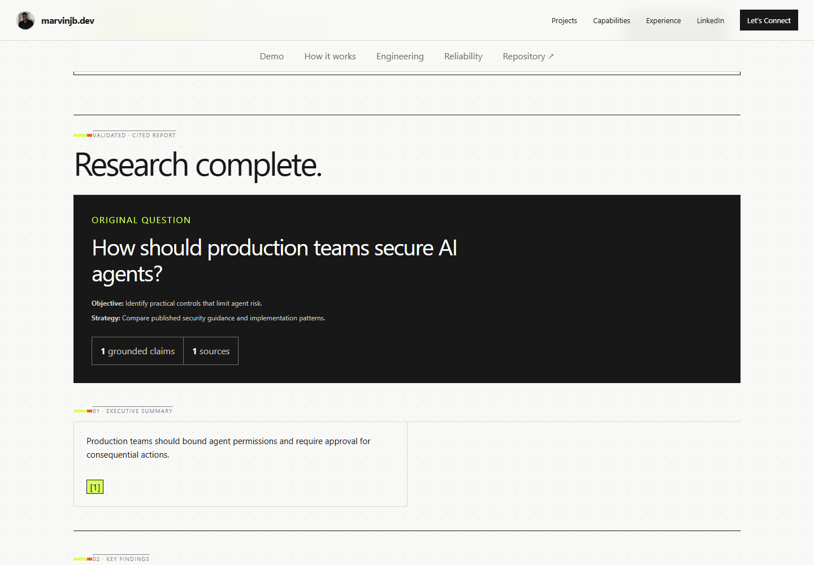

# Research Agent

An evidence-grounded, bounded multi-agent research service. One question becomes a
validated plan, 2–5 focused parallel investigations, deterministic evidence aggregation,
and a cited report whose factual text is resolved from application-owned records.

[Try the live demo](https://marvinjb.dev/demo/research) ·
[Production API](https://api.marvinjb.dev/research) ·
[Architecture](docs/ARCHITECTURE.md) · [Evaluation](docs/EVALUATION.md)



The portfolio demo is provider-backed. Ordinary development and CI are offline: tests use
injected fakes and never call OpenAI, Tavily, or production.

## Why this exists

Useful research automation needs more than an LLM-generated answer. It needs bounded work,
traceable sources, explicit uncertainty, visible disagreement, and validation that prevents
the model from inventing evidence. This project demonstrates those controls in a compact
Python service without pretending to solve web-scale retrieval.

## Workflow


The model plans assignments, authors claim wording at the worker boundary, and selects
application-owned IDs during synthesis. Application code bounds worker count and search,
creates immutable evidence candidates, resolves citations, rejects unknown IDs, preserves
provenance, and constructs the final factual report.

## Architecture and grounding

- The planner chooses **2–5** non-duplicative assignments; callers cannot choose worker
  count. `quick` and `deep` are planning context, not separate hard-coded pipelines.
- Workers run concurrently with `asyncio.gather` inside one service. Each assignment gets
  at most two Tavily Basic searches and at most ten unique normalized source URLs.
- Search snippets become immutable evidence candidates with stable application-generated
  IDs. The worker model selects IDs; it cannot rewrite the cited excerpt.
- Aggregation deduplicates exact URLs and case/whitespace-normalized identical claims. It
  does not use fuzzy matching, embeddings, RAG, or semantic clustering.
- Synthesis selects claim, evidence, and uncertainty IDs. Application code resolves the
  exact factual text and validates every relationship before returning a report.
- Known worker failures are isolated. Successful evidence can still reach synthesis, but
  the workflow fails when every worker fails. There are no replacement workers or retries.

Conflict summaries and recommendation rationale are model-authored interpretation, but
their positions and support must select known claim/evidence IDs. The service surfaces
worker uncertainty and failed-worker metadata instead of silently discarding them.

## Evaluation and trust boundaries

| Invariant | Enforcement | Offline coverage |
| --- | --- | --- |
| Worker count is 2–5 | Pydantic plan validation | 2/5 boundaries and rejection cases |
| Evidence is source-owned | Stable candidate IDs + exact excerpt resolution | Unknown, modified, and mismatched evidence rejection |
| Citations remain grounded | Claim/evidence/source relationship validators | Unknown and unrelated ID rejection |
| Partial failure is explicit | Ordered worker outcome records | One failure continues; all failures stop |
| Provider calls are bounded | Two searches/worker; one analysis/worker; one synthesis | Mock call-count and timeout tests |

The suite currently contains 154 offline tests. Controlled provider checks were performed
during implementation, but the repository does not yet contain a repeatable scored live
evaluation harness. Source relevance, authority, freshness, and claim-level semantic
entailment still require stronger evaluation; strict ID grounding proves provenance, not
that every authored claim perfectly follows from its excerpt. See
[docs/EVALUATION.md](docs/EVALUATION.md).

## Safety and operational controls

- Provider credentials are backend-only runtime variables and excluded from Git/builds.
- CORS defaults to the single portfolio origin `https://marvinjb.dev`.
- All provider-backed POST routes share a process-local limit: 10 accepted requests per
  600 seconds and 2 concurrent requests by default. Rejections return `429` and
  `Retry-After`; `/health` is not rate limited.
- JSON telemetry includes correlation IDs, paths, status, timings, worker/source counts,
  and safe error categories. It excludes questions, prompts, evidence/source text,
  provider bodies, cookies, sensitive headers, and credentials.
- The production image is multi-stage, Python 3.12, non-root, and health checked.

The limiter intentionally coordinates only one process. There is no authentication,
database, durable job state, distributed rate limit, or background queue. FastAPI's
intermediate phase endpoints and OpenAPI UI remain available in v1; changing that public
surface is a future hardening decision, not a packaging change.

## Deployment

The service runs behind Nginx on an Ubuntu VPS and the browser calls
`https://api.marvinjb.dev/research`. The container listens on `0.0.0.0:8000`; the operator
chooses the loopback host port. Nginx needs a 300-second upstream timeout for synchronous
research requests. Full runbook: [docs/DEPLOYMENT.md](docs/DEPLOYMENT.md).

## Technology

Python 3.12 · FastAPI · Pydantic v2 · OpenAI Structured Outputs · Tavily Basic Search ·
asyncio · httpx · pytest · Ruff · Docker · Nginx

## API

The primary endpoint is:

```http
POST /research
Content-Type: application/json

{"question":"How should production teams secure AI agents?","depth":"quick"}
```

It returns a validated `FinalResearchReport`. Diagnostic phase endpoints remain available
for planning, one worker, plan execution, and synthesis. See [docs/API.md](docs/API.md) for
contracts and failure mappings.

## Local development

Python 3.12 is required.

```powershell
python -m venv .venv
.venv\Scripts\Activate.ps1
python -m pip install --constraint requirements.lock -e ".[dev]"
Copy-Item .env.example .env
uvicorn research_agent.main:app --reload
```

Add keys only to the ignored `.env`; never put secrets in `.env.example` or frontend code.

```powershell
Invoke-RestMethod http://127.0.0.1:8000/health
pytest
ruff check .
ruff format --check .
```

## Container

```powershell
docker build -t research-agent:local .
docker run --rm --name research-agent-local --env-file .env -p 8000:8000 research-agent:local
```

The image does not hard-code a host port. Its health check verifies the exact `/health`
payload, and it runs as the unprivileged `research-agent` user.

## Observability

Each HTTP response includes `X-Request-ID`. Structured logs make request duration,
provider/model selection, planner-selected worker count, worker outcomes, source counts,
workflow duration, and safe provider/rate-limit failures visible. Logs answer what failed
and where without recording research content. Metrics and distributed tracing are not
implemented.

## Limitations

- Source selection relies on bounded Tavily snippets; there is no full-document retrieval,
  authority ranking, freshness scoring, or link-health verification.
- Claim wording is authored by the worker model. Exact evidence provenance is enforced,
  but semantic entailment is not mechanically proven.
- `quick`/`deep` influences the planner prompt; it does not impose different numeric search
  budgets or end-to-end deadlines.
- Requests are synchronous and in memory. Restarts lose in-flight work.
- Process-local rate limiting assumes one application process and does not provide fair
  per-user quotas.
- No RAG, vector database, persistence, long-term memory, queue, recursive agents, or
  automatic retries are present.

## Documentation

- [Architecture](docs/ARCHITECTURE.md)
- [API reference](docs/API.md)
- [Evaluation strategy](docs/EVALUATION.md)
- [Deployment runbook](docs/DEPLOYMENT.md)
- [Engineering decisions](docs/DECISIONS.md)
- [Lessons learned](docs/LESSONS_LEARNED.md)
- [Roadmap](docs/ROADMAP.md)
- [Security policy](SECURITY.md)
- [Contributing guide](CONTRIBUTING.md)

## Engineering lessons

The central lesson is that grounding should be an application contract, not a prompt
request. Immutable evidence IDs removed fragile quote reproduction; claim/evidence ID
selection made synthesis deterministic to validate. Exact deduplication is deliberately
less impressive than semantic clustering—and much easier to explain, test, and trust.
