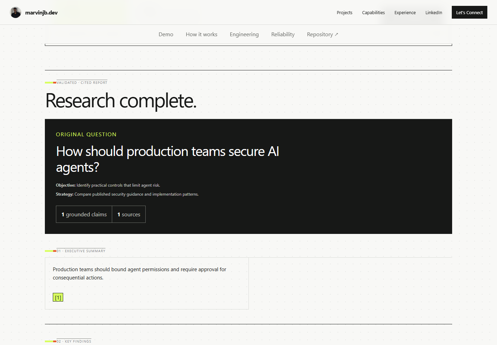
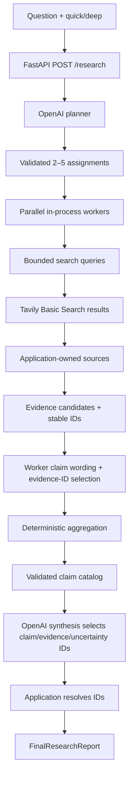

# Research Agent

Research Agent is a production-deployed AI research system that decomposes a broad
question into bounded research tasks, searches multiple sources in parallel, preserves
application-owned evidence, and returns a validated cited report.

[Try the live demo](https://marvinjb.dev/demo/research) ·
[Production API](https://api.marvinjb.dev/research) ·
[Architecture](docs/ARCHITECTURE.md) · [Evaluation](docs/EVALUATION.md)

**Stack:** Python · FastAPI · Pydantic · OpenAI Responses API / Structured Outputs ·
Tavily Basic Search · asyncio · Docker · Nginx



The portfolio demo is provider-backed. Ordinary development and CI are offline: tests use
injected fakes and never call OpenAI, Tavily, or production.

## Why it exists

The goal is to make multi-step AI research more traceable and constrained than a single
free-form model response. This is not simply `question → LLM → answer`. The system uses:

```text
question → plan → parallel research → evidence records → validated claims
         → deterministic aggregation → constrained synthesis → cited report
```

It keeps retrieved evidence connected to each finding, surfaces uncertainty and
disagreement, and rejects references that were not collected during the research process.

## How it works

1. Ask one question.
2. Break it into 2–5 research tasks.
3. Search multiple sources.
4. Collect and validate evidence.
5. Combine findings.
6. Write the final cited report.

## Production verification

In September 2026, exactly three controlled `quick` research jobs were attempted against
the deployed service. These are production smoke/behavior observations—not an accuracy or
source-quality benchmark, SLA, latency guarantee, hallucination rate, scientific dataset,
or proof that every completed report is correct.

| Run | Result | Duration | Validated output observed |
| --- | --- | ---: | --- |
| AI coding assistants: productivity and code quality | HTTP 200 | ~28.73 s | 26 aggregated sources, 20 evidence-backed claims, 0 failed workers |
| Tool-using AI-agent security risks and mitigations | HTTP 200 | ~24.29 s | 8 aggregated sources, 7 evidence-backed claims, 2 failed workers |
| Whether RAG reduces hallucinations and how to evaluate it | HTTP 422 | ~39.52 s | No final report; `research synthesis contains unsupported evidence` |

The second run completed from successful validated work. Its two failed workers were
recorded as `worker returned unsupported evidence`, demonstrating partial-failure isolation.
The third run failed closed at final synthesis, no retry was performed, and the application
returned no report. The bounded observation shows that unsupported grounding can be rejected;
it does not establish the underlying cause of every rejection or measure general reliability.

## What makes it reliable

- **Evidence is application-owned:** the application creates immutable evidence records from
  search results; models select their IDs instead of rewriting the source excerpts.
- **Invalid IDs are rejected:** unknown claim, evidence, source, and uncertainty references
  fail validation.
- **Multiple tasks are bounded:** every plan contains 2–5 focused tasks, with fixed limits on
  searches, sources, concurrency, and public requests.
- **Failed tasks are surfaced:** successful research may continue when one task fails, while
  failed-task metadata remains visible; all-task failure stops the workflow.
- **Final synthesis uses validated inputs:** the report can select only approved claims,
  evidence, and uncertainties collected earlier in the workflow.

## Technical workflow


```mermaid
flowchart TD
    U[Question + quick/deep] --> API[FastAPI POST /research]
    API --> P[OpenAI planner]
    P --> V[Validated 2–5 assignments]
    V --> W[Parallel in-process workers]
    W --> Q[Bounded search queries]
    Q --> T[Tavily Basic Search results]
    T --> S[Application-owned sources]
    S --> E[Evidence candidates + stable IDs]
    E --> WC[Worker claim wording + evidence-ID selection]
    WC --> A[Deterministic aggregation]
    A --> C[Validated claim catalog]
    C --> SY[OpenAI synthesis selects claim/evidence/uncertainty IDs]
    SY --> R[Application resolves IDs]
    R --> F[FinalResearchReport]
```

The model plans assignments, authors claim wording at the worker boundary, and selects
application-owned IDs during synthesis. Application code bounds worker count and search,
creates immutable evidence candidates, resolves citations, rejects unknown IDs, preserves
provenance, and constructs the final factual report.

## Architecture and grounding

- The planner chooses **2–5** non-duplicative assignments; callers cannot choose worker
  count. `quick` and `deep` are planning context, not separate hard-coded pipelines.
- Workers run concurrently with `asyncio.gather` inside one service. Each assignment gets
  at most two Tavily Basic searches and at most ten unique normalized source URLs.
- Search snippets become immutable evidence candidates with stable application-generated
  IDs. The worker model selects IDs; it cannot rewrite the cited excerpt.
- Aggregation deduplicates exact URLs and case/whitespace-normalized identical claims. It
  does not use fuzzy matching, embeddings, RAG, or semantic clustering.
- Synthesis selects claim, evidence, and uncertainty IDs. Application code resolves the
  exact factual text and validates every relationship before returning a report.
- Known worker failures are isolated. Successful evidence can still reach synthesis, but
  the workflow fails when every worker fails. There are no replacement workers or retries.

Conflict summaries and recommendation rationale are model-authored interpretation, but
their positions and support must select known claim/evidence IDs. The service surfaces
worker uncertainty and failed-worker metadata instead of silently discarding them.

## Application versus model responsibility

| Application owns | Model proposes or selects |
| --- | --- |
| Worker-count, search-call, source, concurrency, and request bounds | Research objective, strategy, and assignment wording |
| Source IDs, evidence IDs, exact excerpts, and source relationships | Worker claim wording and evidence-ID selections |
| Claim/evidence validation, deterministic aggregation, and source resolution | Synthesis claim/evidence/uncertainty selections |
| Final factual statement/citation construction and API error mapping | Conflict summaries and recommendation interpretation where allowed |
| Safe logging boundaries | No control over logging fields, tools, or execution budgets |

Models do not create arbitrary source or citation records. They operate inside
application-owned Pydantic contracts and bounded provider interfaces.

## Grounding is not truth

Application-owned IDs prove provenance and structural relationships: where an excerpt
came from, which evidence a worker selected, whether a citation belongs to a known claim,
and whether the final report stayed inside the collected research set. They do not prove
source authority, independence, freshness, factual truth, semantic entailment,
completeness, or absence of bias.

Production searches can return original research, independent publications,
vendor/company analysis, and promotional material. The backend does not implement a
formal source-authority rank, primary/secondary classification, freshness score,
independence score, source-quality score, or citation-quality score. Tavily ordering and
deterministic aggregation must not be interpreted as trust ranking.

## Evaluation and trust boundaries

| Invariant | Enforcement | Offline coverage |
| --- | --- | --- |
| Worker count is 2–5 | Pydantic plan validation | 2/5 boundaries and rejection cases |
| Evidence is source-owned | Stable candidate IDs + exact excerpt resolution | Unknown, modified, and mismatched evidence rejection |
| Citations remain grounded | Claim/evidence/source relationship validators | Unknown and unrelated ID rejection |
| Partial failure is explicit | Ordered worker outcome records | One failure continues; all failures stop |
| Provider calls are bounded | Two searches/worker; one analysis/worker; one synthesis | Mock call-count and timeout tests |

The suite currently contains 154 offline tests. Controlled provider and production checks
have been performed, but the repository does not yet contain a repeatable scored live
research-quality harness. Source relevance, authority, freshness, and claim-level semantic
entailment still require stronger evaluation; strict ID grounding proves provenance, not
that every authored claim perfectly follows from its excerpt. Grounding-validation failures
are useful evaluation signals, but do not by themselves identify whether the model, prompt,
source material, ID handling, or aggregation caused the rejection. See
[docs/EVALUATION.md](docs/EVALUATION.md).

## Safety and operational controls

- Provider credentials are backend-only runtime variables and excluded from Git/builds.
- CORS defaults to the single portfolio origin `https://marvinjb.dev`.
- All provider-backed POST routes share a process-local limit: 10 accepted requests per
  600 seconds and 2 concurrent requests by default. Rejections return `429` and
  `Retry-After`; `/health` is not rate limited.
- JSON telemetry includes correlation IDs, paths, status, timings, worker/source counts,
  and safe error categories. It excludes questions, prompts, evidence/source text,
  provider bodies, cookies, sensitive headers, and credentials.
- The production image is multi-stage, Python 3.12, non-root, and health checked.

The limiter intentionally coordinates only one process. There is no authentication,
database, durable job state, distributed rate limit, or background queue. FastAPI's
intermediate phase endpoints and OpenAPI UI remain available in v1; changing that public
surface is a future hardening decision, not a packaging change.

## Frontend and backend boundary

This repository owns the FastAPI backend, provider adapters, orchestration, evidence
contracts, aggregation, and final report API. The separate `marvinjb.dev` repository owns
the portfolio presentation, including user-facing sections such as Answer, What the
Research Found, Key Findings, Practical Takeaway, Research Confidence, Sources Used in
This Report, and Research Details. It also owns presentation-level source ordering. A
frontend display order based on citation presentation is not a backend source-authority
ranking. Repeated citation occurrences can overstate apparent importance when one source
is cited several times for the same displayed claim; distinct-claim coverage and raw
citation frequency are different measurements.

## Deployment

The service runs behind Nginx on an Ubuntu VPS and the browser calls
`https://api.marvinjb.dev/research`. The container listens on `0.0.0.0:8000`; the verified
VPS deployment maps it to `127.0.0.1:8001`. One Uvicorn process is required by the current
process-local limiter design. Nginx needs a 300-second upstream timeout for synchronous
research requests. Full runbook: [docs/DEPLOYMENT.md](docs/DEPLOYMENT.md).

## Technology

Python 3.12 · FastAPI · Pydantic v2 · OpenAI Structured Outputs · Tavily Basic Search ·
asyncio · httpx · pytest · Ruff · Docker · Nginx

## API

The primary endpoint is:

```http
POST /research
Content-Type: application/json

{"question":"How should production teams secure AI agents?","depth":"quick"}
```

It returns a validated `FinalResearchReport`. Diagnostic phase endpoints remain available
for planning, one worker, plan execution, and synthesis. See [docs/API.md](docs/API.md) for
contracts and failure mappings.

## Local development

Python 3.12 is required.

```powershell
python -m venv .venv
.venv\Scripts\Activate.ps1
python -m pip install --constraint requirements.lock -e ".[dev]"
Copy-Item .env.example .env
uvicorn research_agent.main:app --reload
```

Add keys only to the ignored `.env`; never put secrets in `.env.example` or frontend code.

```powershell
Invoke-RestMethod http://127.0.0.1:8000/health
pytest
ruff check .
ruff format --check .
```

## Container

```powershell
docker build -t research-agent:local .
docker run --rm --name research-agent-local --env-file .env -p 8000:8000 research-agent:local
```

The image does not hard-code a host port. Its health check verifies the exact `/health`
payload, and it runs as the unprivileged `research-agent` user.

## Observability

Each HTTP response includes `X-Request-ID`. Structured logs make request duration,
provider/model selection, planner-selected worker count, worker outcomes, source counts,
workflow duration, and safe provider/rate-limit failures visible. Logs answer what failed
and where without recording research content. Metrics and distributed tracing are not
implemented.

## Limitations

- Source selection relies on bounded Tavily snippets; there is no full-document retrieval,
  authority ranking, primary/secondary classification, freshness scoring, independence
  scoring, citation-quality scoring, or link-health verification.
- Claim wording is authored by the worker model. Exact evidence provenance is enforced,
  but semantic entailment is not mechanically proven.
- `quick`/`deep` influences the planner prompt; it does not impose different numeric search
  budgets or end-to-end deadlines.
- Requests are synchronous and in memory. Restarts lose in-flight work.
- Process-local rate limiting assumes one application process and does not provide fair
  per-user quotas or distributed coordination.
- There is no persistence, database, Redis, durable job queue, background worker system,
  automatic retry, or replacement worker.
- No RAG, embeddings, vector database, long-term memory, or recursive agents are present.
- Strict worker or synthesis grounding validation can reject a request instead of returning
  a report.
- Availability, latency, and research coverage depend on OpenAI, Tavily, and the snippets
  returned for a particular question.

## Documentation

- [Architecture](docs/ARCHITECTURE.md)
- [API reference](docs/API.md)
- [Evaluation strategy](docs/EVALUATION.md)
- [Deployment runbook](docs/DEPLOYMENT.md)
- [Engineering decisions](docs/DECISIONS.md)
- [Lessons learned](docs/LESSONS_LEARNED.md)
- [Roadmap](docs/ROADMAP.md)
- [Security policy](SECURITY.md)
- [Contributing guide](CONTRIBUTING.md)

## Engineering lessons

The central lesson is that grounding should be an application contract, not a prompt
request. Immutable evidence IDs removed fragile quote reproduction; claim/evidence ID
selection made synthesis deterministic to validate. Exact deduplication is deliberately
less impressive than semantic clustering—and much easier to explain, test, and trust.
