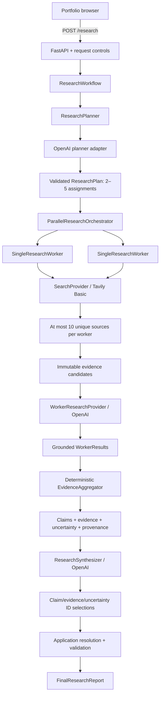

# Architecture

## System boundary

Research Agent is one Python 3.12/FastAPI service. A request carries one question and a
`quick` or `deep` planning hint. The service plans 2–5 assignments, executes one bounded
worker per assignment concurrently, aggregates successful evidence deterministically, and
returns a validated cited report. All state is request-scoped and in memory.

## Ownership: model versus application

| Concern | Model responsibility | Application responsibility |
| --- | --- | --- |
| Planning | Objective, strategy, focused assignments | 2–5 bound, uniqueness, schema |
| Search | None | Fixed query derivation, Basic Search, limits |
| Worker analysis | Claim wording, evidence-ID selection, uncertainty | Candidate IDs, exact excerpts, source relationships |
| Aggregation | None | Exact URL/claim dedupe, provenance, overlap hints |
| Synthesis | Select IDs; author conflict summary/recommendation inference | Resolve factual text/citations; reject unknown or unrelated IDs |

This separation prevents the model from creating source records or reproducing mutable
evidence text. It does not prove semantic entailment between every worker-authored claim
and selected excerpt; that remains an evaluation target.

## Core components

- `ResearchWorkflow` composes existing boundaries and validates every handoff.
- `ResearchPlanner` is the application protocol; `OpenAIResearchPlanner` uses structured
  output. Depth is context supplied to planning, not a hard-coded numeric budget.
- `ParallelResearchOrchestrator` uses `asyncio.gather` on the plan's fixed 2–5 assignments
  and restores plan order in the result.
- `SingleResearchWorker` performs at most two deterministic searches, accepts at most ten
  unique URLs, creates stable evidence candidates, and resolves selected IDs.
- `SearchProvider` isolates Tavily-specific HTTP behavior.
- `EvidenceAggregator` merges exact URLs, merges normalized-identical claim text, records
  obvious containment overlap, and preserves worker/source provenance.
- `ResearchSynthesizer` isolates OpenAI synthesis. The service resolves selections into
  the final report and retains strict Pydantic validators as defense in depth.

## Failure semantics

Known worker search/provider/timeout/evidence failures become ordered per-worker outcomes.
One successful worker is sufficient to continue to synthesis; all-worker failure stops the
workflow with HTTP 424. Planning and synthesis provider failures map to 502, timeouts to
504, missing configuration to 503, and unsupported structured evidence to 422. Unexpected
programming errors propagate rather than being mislabeled as provider errors. No layer
automatically retries or creates replacement workers.

## Runtime and trust boundary

The browser may call the service only from configured CORS origin `https://marvinjb.dev`.
All provider-backed POST routes share one process-local acceptance window and concurrency
budget; `/health` is unlimited. Credentials enter only as runtime environment variables.
The non-root container exposes internal port 8000 and is reverse-proxied by Nginx. A
300-second proxy response timeout accommodates the synchronous workflow.

JSON telemetry contains a safe request ID, route, response status, duration, research mode,
provider/model, planner worker count, worker outcome/duration/source count, total workflow
duration, and controlled failure category. Research questions, prompts, provider payloads,
evidence and source content, cookies, headers, and credentials are excluded.

## Explicit v1 boundaries

- One question per request; 1–2,000 characters.
- Two to five workers, in-process and concurrent—not deployed worker services.
- Two searches and ten unique normalized sources at most per worker.
- No persistence, database, background jobs, queue, RAG, embeddings, vector store,
  long-term memory, recursive spawning, retries, or replacement workers.
- No full-page content fetch, semantic deduplication, source authority scoring, or
  guaranteed conflict recall.
- No distributed rate limiting or horizontal coordination.
- OpenAPI and intermediate phase endpoints remain part of the current API surface.
- The user interface lives in the separate `marvinjb.dev` repository; this repository owns
  only the backend service.

## Scaling path

For higher traffic, first introduce durable job state and an explicit asynchronous job
contract. Then move cost controls to shared infrastructure, add per-client quotas, enforce
an overall deadline, and separate work execution only when measurements justify it. Source
quality should improve through document retrieval and evaluation before adding embeddings
or semantic clustering merely for architectural appearance.
